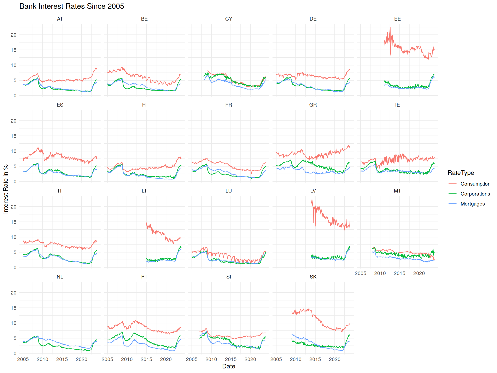
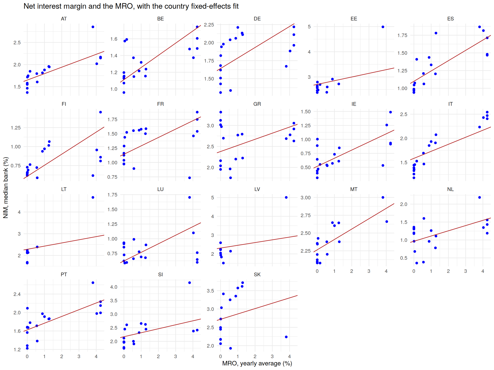
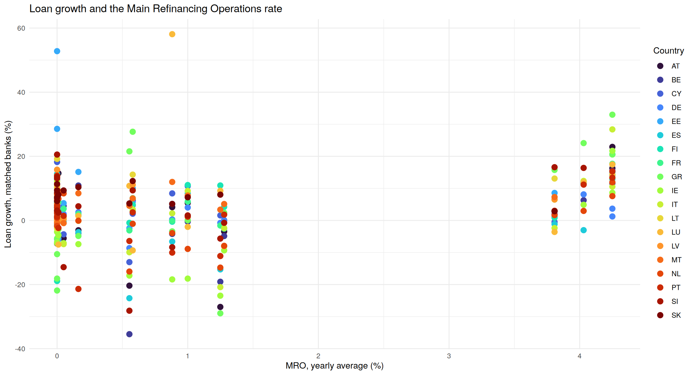

# Monetary Policy and Bank Lending in the Euro Area, 2005–2023

How the ECB main refinancing rate (MRO) relates to bank lending rates, loan growth, net interest
margins and credit risk across euro area countries: panel regressions with country fixed effects
on monthly ECB statistics and bank-level BankFocus data.

**Bottom line.** Policy rates reach corporate and mortgage rates far more than consumer credit:
a 1 point higher MRO goes with lending rates about 0.66 points higher for corporations, 0.57 for
mortgages and 0.31 for consumer credit. Higher rates also go with wider bank margins, about
0.15 points of NIM per point of MRO. Loan growth, NPL and loan loss reserves are also
associated with the MRO, but these associations reflect the credit cycle more than the effect
of policy.

## Project overview

- **Question.** Does the ECB policy rate move the rates banks charge, the amount they lend,
  their margins and their credit risk, and how much does this differ across countries?
- **Scope.** Up to 20 euro area countries, 2005–2023; each country enters from the year it
  adopted the euro.
- **Method.** Every model regresses one variable on the MRO with **country fixed effects**, so
  it uses only the variation over time within each country. Standard errors are
  **Driscoll-Kraay**, robust to autocorrelation and to correlation across countries; the usual
  and the country-clustered ones are reported in the notebook for comparison.
- **Diagnostic tests.** F test for country effects, Breusch-Godfrey/Wooldridge test for serial
  correlation, Pesaran CD test for cross-sectional dependence and Hausman test (fixed against
  random effects).
- **Policy rates.** Official ECB rates change on specific dates; each rate is carried forward
  until its next change and averaged over calendar days (time-weighted), by month or by year.

## Data

- **Public, included in `data/`.** ECB Data Portal: official ECB rates (MRO, deposit facility,
  marginal lending facility) and MFI interest rates by country for consumer credit, loans for
  house purchase and loans to corporations, monthly.
- **Licensed, not included.** BankFocus (Moody's / Bureau van Dijk), annual accounts of euro area
  banks, 2005–2023. Nothing in this repository is shown at the level of individual banks: the
  notebook, the tables and the charts contain only country aggregates.

BankFocus coverage changes a lot over twenty years: the number of banks with loan data almost
doubles, and German banks alone go from 938 in 2012 to 1,855 in 2013. Summing loans over the
banks available each year would confuse credit growth with banks entering the database, and
push the country totals up exactly while the MRO was falling. Four rules keep the comparisons
clean:

1. **Loan growth on matched banks.** Growth in a year is computed only on the banks that report
   loans in that year and the previous one, as the ECB does for growth rates of loans.
2. **Balanced samples for ratios.** The net interest margin uses the banks that report it every
   year since 2005, or since their country joined the euro. NPL and loan loss reserves are
   reported by few banks before 2013, so they use the banks that report them every year from
   2013.
3. **One statement per bank and year**, by consolidation code, with central banks and statements
   without financials removed (same rules as Case Study 1).
4. **Statistical confidentiality.** Following the ECB's rule for published statistics, no country
   value is shown if it rests on fewer than 3 banks.

## Results

Coefficient on the MRO, country fixed effects, Driscoll-Kraay standard errors (12 lags for the
monthly lending rates, 2 for the yearly bank data):

| Dependent variable | Coefficient | Std. error | p-value | Within R² | Countries | Obs. |
|---|---|---|---|---|---|---|
| Lending rate, corporations (%) | 0.66 | 0.073 | <0.001 | 0.68 | 19 | 3,888 |
| Lending rate, mortgages (%) | 0.57 | 0.072 | <0.001 | 0.61 | 19 | 3,888 |
| Lending rate, consumer credit (%) | 0.31 | 0.066 | <0.001 | 0.12 | 18 | 3,558 |
| Loan growth (%) | 2.18 | 0.988 | 0.028 | 0.10 | 19 | 305 |
| Net interest margin (%) | 0.15 | 0.038 | <0.001 | 0.28 | 19 | 309 |
| NPL ratio (%) | −1.65 | 0.392 | <0.001 | 0.06 | 20 | 207 |
| Loan loss reserves / net loans (%) | −0.85 | 0.224 | <0.001 | 0.06 | 20 | 207 |

**Diagnostic tests.** Country effects are significant in every model, so pooled OLS is
rejected. Residuals are strongly autocorrelated and correlated across countries: all countries
share the same policy rate and the same shocks (the financial and sovereign debt crises, the
pandemic, the 2022 inflation). Usual standard errors are therefore far too small, and
clustering by country is not enough; Driscoll-Kraay standard errors correct for both. The
Hausman test does not reject in five models out of seven. It rejects for mortgage rates, where
the fixed- and random-effects coefficients are identical and the rejection only reflects the
sample size, and for loan growth (2.2 against 1.9). Since the MRO is common to all countries,
the two estimators differ little by construction, and fixed effects are kept throughout.

**Pass-through to lending rates** Corporate and mortgage rates move by
about two thirds and more than half of any change in the MRO, and the MRO alone explains most of
their variation over time. Consumer credit rates are driven by other factors: pass-through is a
third and the explained variation small.

**Net interest margins widen when rates rise.** Across countries, the typical net interest margin
(median of the country medians) fell from about 1.9% in 2010–2011 to 1.3% in 2021, during the
years of zero and negative rates, and jumped to 2.2% in 2023 after the hikes.

**The other associations should not be read as effects of policy.**
- *Loan growth is higher when the MRO is higher.* This does not mean that higher rates increase
  lending: the ECB raises rates when credit and the economy are growing fast (2006–2008,
  2022–2023) and cuts them in downturns. The regression picks up this reverse causality. It is
  also the least robust result: with Driscoll-Kraay standard errors the p-value rises from
  below 0.001 to 0.028.
- *NPL and loan loss reserves are lower when the MRO is higher.* Between 2013 and 2023 the
  NPL ratio of the median country fell from about 6% to 2.5% as banks cleaned up their balance
  sheets, and the MRO rose only at the very end of that period. The negative coefficient
  reflects the coincidence of the two trends, not lower credit risk caused by higher rates.

## Code

The analysis is written in R:

| File | Content |
|---|---|
| `cs3_policy_rate_and_lending.ipynb` | notebook with the full analysis step by step. It is saved already executed, so every table and all 14 charts can be read directly on GitHub |
| `cs3_policy_rate_and_lending.R` | the same analysis as a single script. With the public data included it runs the pass-through analysis; the BankFocus part runs only where the licensed files are available |

R packages: readxl, readr, dplyr, tidyr, purrr, stringr, ggplot2, scales, plm, lmtest.
The script saves the regression and diagnostics tables to `output/`.

## Limitations

- **Associations, not causal effects.** A country fixed-effects regression on the policy rate
  cannot separate the effect of policy from the economic conditions the ECB responds to. This
  matters little for lending rates, which are priced mechanically off market rates, and a lot for
  lending volumes and credit risk.
- **One common policy rate.** The MRO is the same for every country, so all the identifying
  variation is over time; year or month fixed effects cannot be added. In practice the
  regressions rest on a few rate cycles (19 years, 11 for NPL and reserves), which is why
  standard errors robust to common shocks matter.
- **Mergers affect loan growth.** When a bank absorbs another one, its loans jump even though
  total credit does not change; the matched-bank method removes banks entering the database but
  not mergers, which explains a few extreme growth rates.
- **Levels in the original study.** The original case study regressed the level of country loans
  on the MRO and on bank size controls. That specification is dominated by the growth of
  BankFocus coverage and by the mechanical link between loans and total assets, so it is
  replaced here by loan growth on matched banks.

## Conclusion

Monetary policy reaches the price of credit quickly and strongly for firms and mortgage
borrowers, and weakly for consumer credit, and it moves bank margins in the same direction.
Its effect on the quantity of credit and on credit risk cannot be read from simple panel
regressions on the policy rate: over 2005–2023 these are dominated by the credit cycle and by
the post-crisis clean-up of bank balance sheets.
